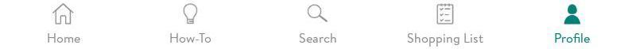
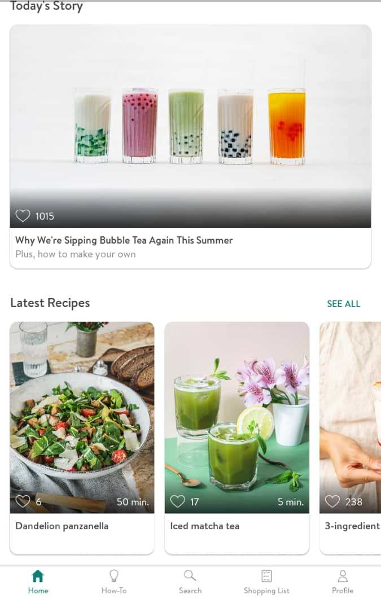
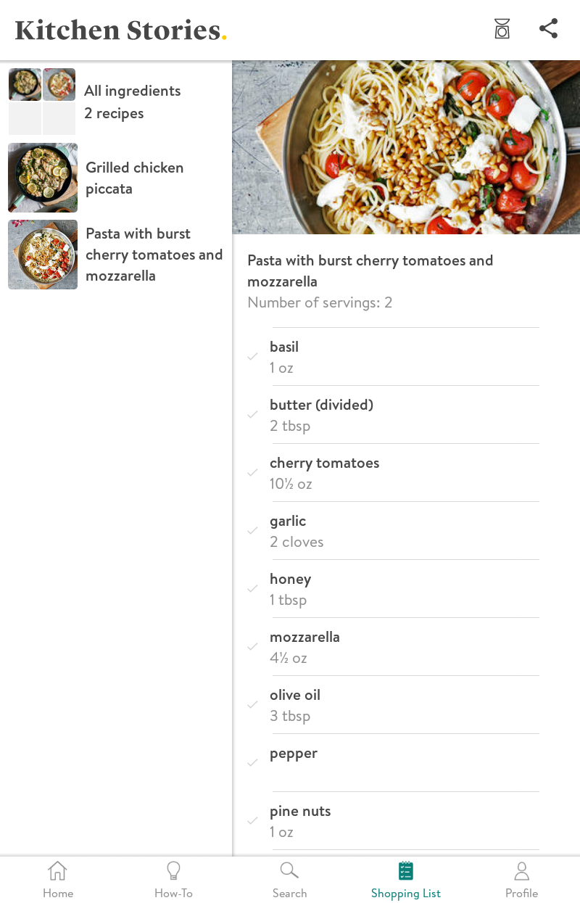

# Kitchen Stories.
----
### [درباره اپلیکیشن](#aboutApp)
#### موارد مورد بررسی در اپلیکیشن

در صفحه اصلی اپلیکیشن 5 گزینه مارک شده است که شما می توانید در هر کجای برنامه که باشید به آن دسترسی داشته باشید

1. [Home](#Home)
2. [How-To](#How_To)
3. [Search](#search)
4.
5. [Shopping List](#shoppingList)
6. [Profile](#profile)

> 
درباره اپلیکیشن

> 
Home

در این صفحه یکسری از پیشنهادات مختلف بر اساس مواردی که کاربران امروز پست کرده اند یا مواردی که بیشترین امتیاز مثبت آورده اند و غیره پیشنهادهایی به کاربر می شود.

> 
How-To

در این صفحه شما فقط می توانید موارد و نکات اولیه آشپزی مانند نحوه خورد کردن انواع مواد غذایی یا درست کردن سس و خیلی از موارد دیگر را بصورت فیلم تماشا کنید در این قسمت هیچ موردی برای نظر دادن وجود ندارد تنها کار ممک ممکن مشاهده چندین نکات آشپزی می باشد.

> 
Search

1. در این قسمت میتوانید مستقیما موردی را که می خواهید سرچ کنید( مثلا نوع غذا مورد نظر یا کشور مورد نظر یا هر کلید واژه دیگر)
    

    
    

2. بطور پیش فرض گزینه هایی در اختیار شما قرار میگیرد که با انتخاب هر کدام میتوانید  غذاهای مربوط به آن بخش را مشاهده کنید (مثل انتخاب پاستا یا دسر یا غذاهایی که سریع آماده می شوند.)

  

  
  

3. در بخش سوم می توانید مستقیم یکسری از فیلتر ها را اعمال کنید

  I. Filter:
    

    

    - Category
    - Diet
    - Cuisine
    - Main ingredients
    - Occasion
    - type

  II. Change sorting: (مواردی که در قسمت فیلتر انتخاب می شود در این قسمت تغیین می شود موارد کشف شده بر چه اساسی نمایش داده شود)
      

      

    - Relevance
    - Likes
    - Commented
    - Release date

> 
Shopping List

در این بخش می توانید مواردی که قبلا به قسمت لیست خرید اضافه کرده اید را ما مشاهده کنید. ( در این بخش مواد غذایی و مقداری که شما لازم دارید نمایش داده می شود)

> 
Profile

