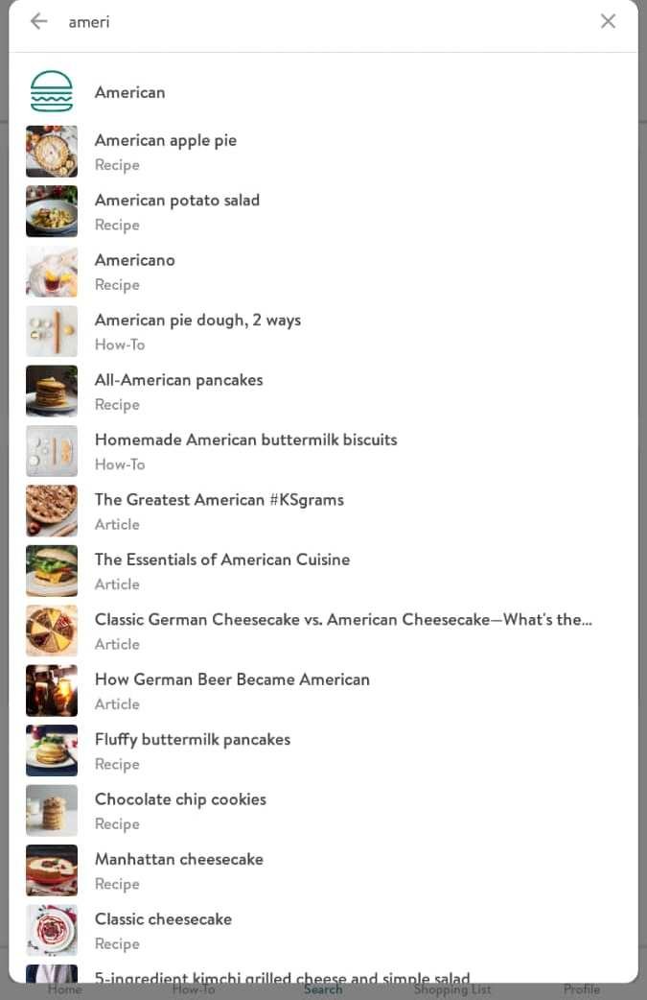
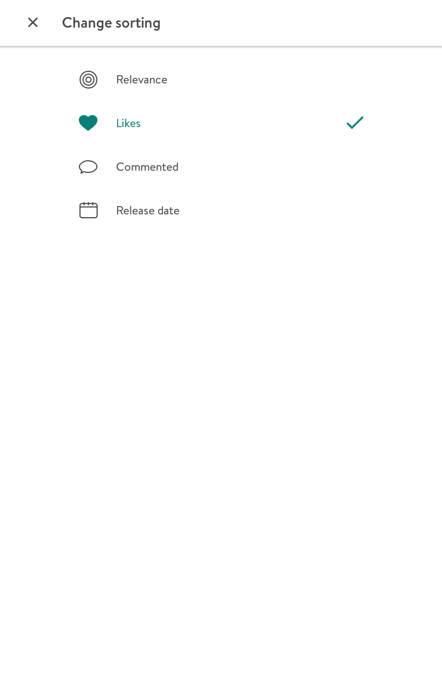

# Kitchen Stories.
----
### [درباره اپلیکیشن](#aboutApp)
#### موارد مورد بررسی در اپلیکیشن

در صفحه اصلی اپلیکیشن 5 گزینه مارک شده است که شما می توانید در هر کجای برنامه که باشید به آن دسترسی داشته باشید

1. [Home](#Home)
2. [How-To](#How_To)
3. [Search](#search)
4. [View post](#view)
5. [Shopping List](#shoppingList)
6. [Profile](#profile)

> 
درباره اپلیکیشن

> 
Home

در این صفحه یکسری از پیشنهادات مختلف بر اساس مواردی که کاربران امروز پست کرده اند یا مواردی که بیشترین امتیاز مثبت آورده اند و غیره پیشنهادهایی به کاربر می شود.

 
> 
How-To

در این صفحه شما فقط می توانید موارد و نکات اولیه آشپزی مانند نحوه خورد کردن انواع مواد غذایی یا درست کردن سس و خیلی از موارد دیگر را بصورت فیلم تماشا کنید در این قسمت هیچ موردی برای نظر دادن وجود ندارد تنها کار ممک ممکن مشاهده چندین نکات آشپزی می باشد.

 

> 
Search

1. در این قسمت میتوانید مستقیما موردی را که می خواهید سرچ کنید( مثلا نوع غذا مورد نظر یا کشور مورد نظر یا هر کلید واژه دیگر)
 
 
2. بطور پیش فرض گزینه هایی در اختیار شما قرار میگیرد که با انتخاب هر کدام میتوانید  غذاهای مربوط به آن بخش را مشاهده کنید (مثل انتخاب پاستا یا دسر یا غذاهایی که سریع آماده می شوند.)

 
  
3. در بخش سوم می توانید مستقیم یکسری از فیلتر ها را اعمال کنید

  I. Filter:
      
   
    - Category
    - Diet
    - Cuisine
    - Main ingredients
    - Occasion
    - type

  II. Change sorting: (مواردی که در قسمت فیلتر انتخاب می شود در این قسمت تغیین می شود موارد کشف شده بر چه اساسی نمایش داده شود)
     
    
    - Relevance
    - Likes
    - Commented
    - Release date

> 
View post

زمانی که شما پستی را انتخاب میکنید تا مشاهده کنید به طور کل از چند بخش زیر تشکلی شده پاستا

+ video 
  + اگر فیلمی از نحوه ساخت غذا وجود داشته باشد شما در این بخش میتوانید با اجرای فیلم آن را تماشا کنید.
+ rate
  + امتیازی که این غذا آورده است به صورت 5 ستاره نشان می دهد
+ like and save
  + می توانید این پست را لایک  کنید یا آن را در قسمت دسته بند های خود ذخیره کنید.
+ creator name
  + تمام نظرات خوانندگان را می توانید مشاهده کنید. همچنین تمام کسانی که این غذا را درست کرده اند می توانند از غذای خود عکس گرفته و بفرستند
+ Difficulty
  + نوع تهیه غذا بسته به راحت و سخت بودن برچسب خورده است 
+ Time of cooking
  + مدت زمانی که طول می کشد غذا درست شود
+ ingredients
  + میزان مواد مورد نیاز برای تهیه غذا بسته به اینکه چه تعداد را انتخاب می کنید میزان مواد غذایی تغییر می کند
+ Step 
  + مراحل ساخت غذا با کامنتی در زیر آنها همران با عکس نمایش داده شده است 
+ Tags
+ Start cooking! 
  + اگر این گزینه را انتخاب کنید میتوانید فقط مراحل ساخت غذا را ببینید 

> 
Shopping List

در این بخش می توانید مواردی که قبلا به قسمت لیست خرید اضافه کرده اید را ما مشاهده کنید. ( در این بخش مواد غذایی و مقداری که شما لازم دارید نمایش داده می شود)
 
 
> 
Profile

